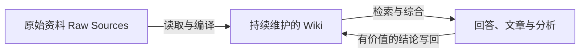

> **摘要**
>
> Andrej Karpathy 提出的 LLM Wiki，不是一个具体产品，也不是又一套复杂的知识管理软件。它是一种工作模式：让 LLM 把持续进入的原始资料编译成结构化、相互链接、不断维护的 Markdown Wiki。用户负责选择资料、提出问题和做出判断，LLM 负责摘要、归档、交叉引用与日常维护。它真正改变的不是“如何搜索文档”，而是“AI 的工作成果能否在下一次对话中继续存在并增值”。

2026 年 4 月，Andrej Karpathy 发布了一份名为 [LLM Wiki](https://gist.github.com/karpathy/442a6bf555914893e9891c11519de94f) 的 idea file。他没有提供一个开箱即用的软件，而是给出了一种可以交给 Codex、Claude Code 等 Agent 实现的知识工作范式。

这份文档最有吸引力的地方，是它把一个朴素的问题说透了：我们每天借助 LLM 阅读、总结和分析大量资料，但这些劳动往往随着聊天窗口关闭而消失。下一次遇到相似问题，模型又要重新检索、重新拼接、重新得出近似的答案。知识被反复消费，却没有真正积累下来。

LLM Wiki 想改变的，正是这种“每次从零开始”的状态。

## 从检索知识到编译知识

常见的 RAG 工作流是：保存原始文档，在用户提问时检索相关片段，再让模型临时组合答案。这种方法很有用，但它的主要产物是一次性的回答。即使模型为了回答一个复杂问题读了五篇资料、识别了其中的矛盾，并形成了一份不错的综合判断，这些中间成果也未必会被保存。

Karpathy 提出的思路则是：在用户与原始资料之间增加一个持久的 Wiki 层。



当一篇新论文或文章进入系统时，LLM 不只是给它建立索引，而是把信息整合进已有知识结构：创建来源摘要，更新相关人物、概念和主题页面，补充交叉链接，标记新旧材料的分歧，并调整当前的综合认识。

因此，Wiki 不是原始资料的另一份静态副本，而是一个持续演化的“已编译知识层”。一次高质量分析也不应留在聊天记录里，而应成为新页面，或者被写回已有页面。知识由此开始复利。

> **核心区别**
>
> RAG 侧重在提问时找到相关材料；LLM Wiki 侧重把已经完成的理解保存下来，并在以后继续修订。两者并不必然互斥。Wiki 较小时可以直接阅读 Markdown；规模扩大后，依然可以用全文检索、BM25 或向量检索帮助定位页面。

## 三层架构：来源、Wiki 与规则

Karpathy 将系统分成三个层次。

### 1. Raw Sources：不可随意改写的事实底座

这一层存放用户选择的论文、文章、图片、数据和其他原始资料。LLM 可以读取它们，但不应修改它们。原始资料保留了上下文和证据，是发生争议时可以回看的来源依据。

“不可变”并不意味着来源一定正确，而是意味着不能让模型在整理过程中悄悄改写证据。来源的可信度仍然需要用户判断。

### 2. Wiki：由 LLM 维护的知识层

Wiki 是一组互相链接的 Markdown 文件，可以包含来源摘要、实体页面、概念页面、比较、专题综述和阶段性结论。Karpathy 对这层的分工很激进：人主要阅读，LLM 负责写作与维护。

这种安排把 LLM 放在了最擅长的位置——处理大量重复但需要语言理解的工作，例如：

- 将新材料归入已有主题；
- 同时更新多个相关页面；
- 维护页面之间的双向链接；
- 找出相互矛盾或已经过时的说法；
- 把一次问答中产生的新理解保存下来。

### 3. Schema：人和 Agent 之间的工作契约

Schema 通常表现为 `AGENTS.md`、`CLAUDE.md` 或类似的说明文件。它规定目录结构、页面类型、命名方式、引用格式，以及 Agent 在导入、查询和维护时应该遵循的流程。

这一层常被低估。没有 Schema，LLM 只是一个偶尔帮忙写笔记的聊天机器人；有了明确、可演化的 Schema，它才可能成为一个行为相对稳定的 Wiki 维护者。

Schema 也不是一次设计完成的。人和 LLM 会在实践中共同修改它：哪些元数据确实有用，页面应该拆多细，什么时候创建新概念页，发生冲突时如何标记，都要从真实使用中逐渐长出来。

## 三种核心操作：Ingest、Query 与 Lint

### Ingest：把新来源融入旧知识

导入不是“上传文件后生成摘要”这么简单。一个完整流程可能包括：

1. 读取一个新来源；
2. 与用户讨论关键结论和关注重点；
3. 创建来源摘要；
4. 更新相关概念页和实体页；
5. 更新索引；
6. 在日志中记录这次变更。

一份来源可能同时改变十几个页面。Karpathy 更偏好一次处理一个来源，并参与查看摘要和指导重点，而不是完全无人监督地批量吞入资料。这说明 LLM Wiki 虽由模型承担维护工作，却不是一个主张人类退出回路的系统。

### Query：让好问题留下可复用的结果

查询时，Agent 先定位相关 Wiki 页面，再综合回答并附上来源。输出不一定只是聊天文本，也可以是一篇新文章、比较表、图表或演示文稿。

真正关键的是“写回”：如果这次问题促成了新的比较、新的联系或更成熟的解释，就应把成果放回 Wiki。提问不再只是消费知识，也是生产知识结构的一部分。

### Lint：给知识库做健康检查

随着 Wiki 增长，Agent 需要定期检查：

- 页面之间是否存在矛盾；
- 旧结论是否已被新来源取代；
- 是否出现没有入链的孤立页面；
- 是否有反复出现、却没有独立页面的重要概念；
- 是否缺少必要的交叉引用；
- 哪些知识缺口值得继续搜索资料。

这一步相当于软件工程中的静态检查和重构。知识库不是“写完即完成”的文档集合，而是一套需要保持一致性的长期系统。

## `index.md` 与 `log.md`：空间地图和时间轴

Karpathy 特别区分了两个导航文件：

- `index.md` 面向内容，按类别列出页面、链接和简短说明。Agent 回答问题时可以先读索引，再进入具体页面。
- `log.md` 面向时间，以追加方式记录导入、查询和健康检查，帮助人和 Agent 理解知识库最近发生了什么。

一个回答“这里有什么”，另一个回答“这里经历了什么”。对于中等规模的 Wiki，一个维护良好的索引可能已经足以导航，不必一开始就搭建向量数据库。需要更强搜索能力时，再逐渐加入本地全文或混合检索即可。

## 为什么 Markdown、Obsidian 与 Git 很适合这件事

LLM Wiki 的基础设施看起来甚至有点“反潮流”：文件夹、纯文本、链接、命令行和 Git，而不是先搭数据库和复杂服务。但这种简单性恰好带来几个优势：

- Markdown 对人和 LLM 都可读；
- Wiki Links 能把目录自然变成知识图谱；
- Obsidian 适合浏览链接、反向链接和局部关系图；
- Git 提供版本历史、差异比较、分支和协作；
- 文件不被单一平台锁定，迁移成本较低。

Karpathy 用了一个很传神的类比：Obsidian 像 IDE，LLM 像程序员，Wiki 则像代码库。这个类比意味着我们不只是在“记笔记”，而是在维护一种可检查、可重构、可追踪的知识工程产物。

## 最值得警惕的地方：错误也会复利

“知识复利”有一个镜像风险：如果一个未经核验的模型总结被写入 Wiki，后来又被其他页面引用，它也可能逐渐变成貌似稳定的错误共识。

因此，真正可靠的 LLM Wiki 至少需要以下约束：

1. **来源与综合分层**：原始资料不能被 Wiki 页面取代。
2. **保留可追溯性**：关键事实应能追溯到具体来源，而不是只引用另一篇 AI 总结。
3. **显式表达不确定性**：区分事实、作者观点、模型推断和待验证问题。
4. **重要内容人工审阅**：尤其是准备公开发布的文章。
5. **用 Git 审查变化**：关注 Agent 修改了哪些页面，而不只阅读最终答案。
6. **定期 Lint**：矛盾、断链、过时信息和重复页面不会自行消失。

LLM 不会因为维护工作枯燥而放弃，但它也不会天然知道哪些错误代价最高。维护成本可以交给模型，认识论责任仍然属于人。

## 对个人 LLM Wiki 的启发

如果准备从零开始实践，一个足够小、却能形成闭环的目录是：

```text
Sources/      保存原始文章、论文与网页快照，只读
Papers/       记录单篇论文或来源的摘要
Concepts/     维护可复用的概念页面
Articles/     保存跨来源综合与公开文章
index.md      作为内容地图
log.md        记录导入、查询和维护活动
AGENTS.md     定义 Agent 的维护规则
```

每次加入新来源时，不以“生成了一篇摘要”为完成标准，而应追问：

- 它更新了哪些已有概念？
- 它与哪些旧结论一致或冲突？
- 是否产生了值得长期保存的新问题？
- 哪些变化需要在 Git diff 中人工确认？

在发布侧，可以使用显式白名单：只有经过审阅并标记为公开、允许发布的文章才进入个人网站。这样，内部 Wiki 可以保留探索过程、未完成判断和私人笔记，公开网站则展示相对成熟的知识成果。

## 结语：不是更会回答，而是更会积累

Karpathy 的 LLM Wiki 思想并没有发明 Markdown、Wiki、双向链接或个人知识管理。它真正的新意，是重新分配了维护知识库的劳动：让人负责选择、方向和判断，让 LLM 承担长期以来最容易拖垮个人 Wiki 的整理工作。

当 AI 的输出从短暂的聊天回答，变成可以持续检查、修订和连接的文件时，LLM 就不再只是一个问答工具，而开始成为知识基础设施的一部分。

这也是 LLM Wiki 最值得实践的地方：不是让模型替我们思考，而是让每一次认真思考都更不容易丢失。

## 参考资料

- Andrej Karpathy, [LLM Wiki: A pattern for building personal knowledge bases using LLMs](https://gist.github.com/karpathy/442a6bf555914893e9891c11519de94f), 2026-04-04，访问于 2026-07-05。
